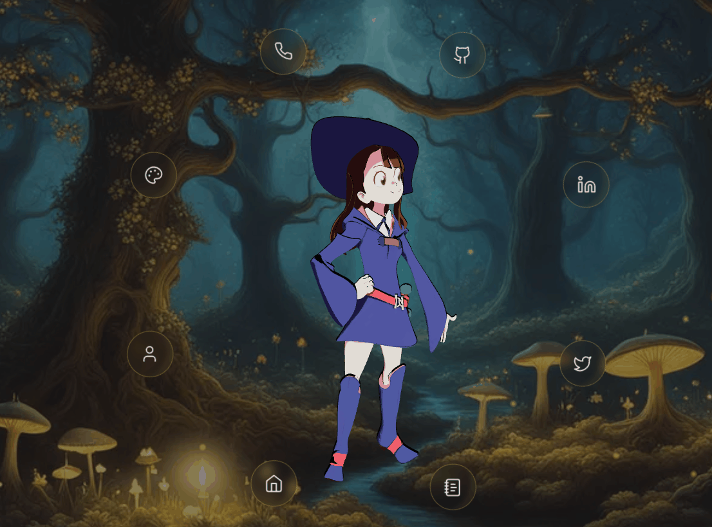
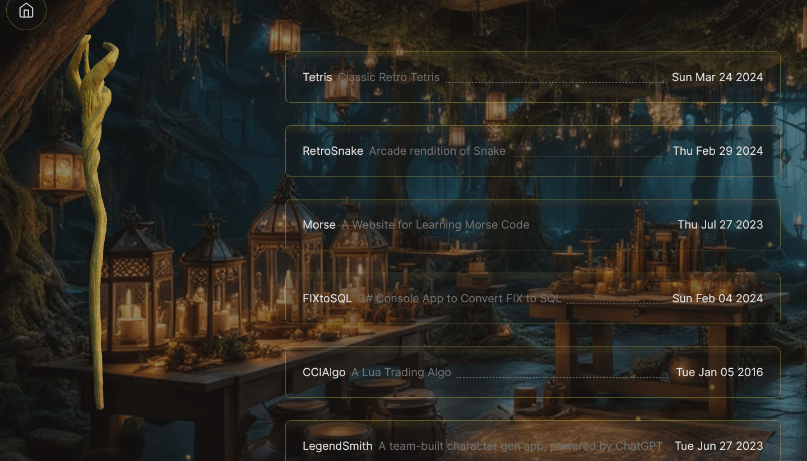

# Magic Portfolio

A nifty portfolio built following this tutorial:&nbsp;&nbsp;<br />
💚 [Personal Portfolio Website with Next.js, Three.js & Tailwind CSS Tutorial](https://youtu.be/T5t46vuW8fo)
[](https://youtu.be/T5t46vuW8fo) <br />

## Project Screenshots

Home Page:</br></br>
 </br></br>
Projects Page:</br></br>
</br></br>
About Page:</br></br>
</br></br>

## Resources Used in This Project

#### 3D Models

- ["Little Witch Academia"](https://skfb.ly/68rny) by [qnaman is licensed under Creative Commons Attribution](http://creativecommons.org/licenses/by/4.0/).
- ["Stylized wizard hat"](https://skfb.ly/ozxOQ) by [Enkarra is licensed under Creative Commons Attribution](http://creativecommons.org/licenses/by/4.0/).
- ["Wizard Staff"](https://skfb.ly/6QYZw) by [Toymancer Studio is licensed under Creative Commons Attribution](http://creativecommons.org/licenses/by/4.0/).

#### AI Images

- Created with the help of [Playground AI](https://playgroundai.com/)

#### Development Resources

- Fonts from [Google Fonts](https://fonts.google.com/) <br />
- Icons from [Lucide Icons](https://lucide.dev/) <br />
- Notifications from [Sonner](https://sonner.emilkowal.ski/) <br />
- Form created using [react-hook-form](https://react-hook-form.com/) <br />
- Animations using [framer-motion](https://www.framer.com/motion/) <br />
- Emails using [Emailjs](https://www.emailjs.com/) <br />
- Convert 3d models to JSX using [Gltf JSX](https://github.com/pmndrs/gltfjsx)

#### Audio

- Music by <a href="https://pixabay.com/users/shidenbeatsmusic-25676252/?utm_source=link-attribution&utm_medium=referral&utm_campaign=music&utm_content=20772">Shiden Beats Music</a> from <a href="https://pixabay.com/music//?utm_source=link-attribution&utm_medium=referral&utm_campaign=music&utm_content=20772">Pixabay</a>

---

This is a [Next.js](https://nextjs.org/) project bootstrapped with [`create-next-app`](https://github.com/vercel/next.js/tree/canary/packages/create-next-app).

## Getting Started

First, install the dependencies and run the development server:

```bash
npm run install # to install all dependencies

npm run dev
# or
yarn dev
# or
pnpm dev
# or
bun dev
```

Open [http://localhost:3000](http://localhost:3000) with your browser to see the result.
